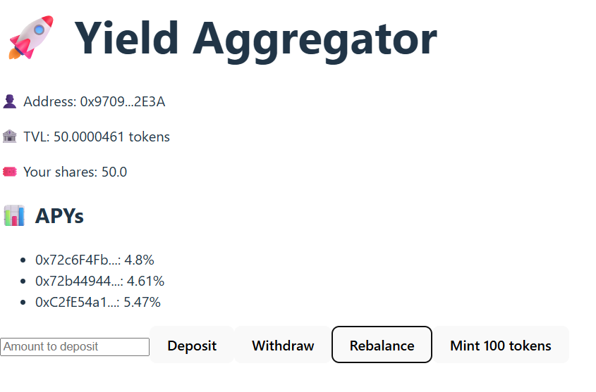

# SmartVault 🧠

**SmartVault** is a full-stack Web3 project featuring a decentralized Yield Aggregator with multiple strategies, share-based accounting, simulated on-chain APY, and automatic rebalancing. Inspired by protocols like Yearn and Beefy, it dynamically allocates user deposits across Aave, Compound, and Yearn mock strategies, choosing the best APY in real time.

Built in 3 weeks as the third milestone of my Solidity journey (after NeoGuilder and TokenMarket), SmartVault is modular, auditable, testable, and fully functional on the Holesky testnet — with a connected front-end.

---

## 🚀 Features

✅ **Share-Based Vault Logic**  
- Users deposit `UnderlyingToken` and receive shares  
- Withdrawals are proportional to vault balance  
- Yield is simulated via block-based APY

✅ **Dynamic Strategy Rebalancing**  
- 3 mock strategies (Aave, Compound, Yearn)  
- Oracle compares APY across strategies  
- Vault reallocates capital automatically

✅ **Performance Fee Mechanism**  
- 10% performance fee on profit (configurable)  
- Sent to a designated feeRecipient  
- Calculated on each rebalance

✅ **Frontend (React + Ethers.js v6)**  
- Connect wallet (MetaMask)  
- Deposit / Withdraw  
- See live APY per strategy  
- Rebalance vault to best performer  
- View vault TVL and your shares

✅ **Unit Tests (Hardhat + Chai)**  
- Deposit / Withdraw flow  
- Strategy switching  
- Yield simulation  
- Fee collection

✅ **Modular Contract Architecture**  
- Vault logic  
- Strategy interface  
- Oracle abstraction  
- Fee manager  
- Optional modules (KYC, Reputation, Sustainability)

---

## 📦 Installation & Setup

### 1️⃣ Prerequisites

Make sure you have the following installed:

- Node.js  
- MetaMask  
- Hardhat

### 2️⃣ Clone the Repository

git clone https://github.com/DenoyelSeb/SmartVault.git
cd SmartVault

### 3️⃣ Install Dependencies

npm install

Used dependencies:
- ethers
- hardhat
- @openzeppelin/contracts

### 4️⃣ Compile & Deploy to Holesky

npx hardhat compile
npx hardhat run scripts/deploy.js --network holesky

Optional: use scripts/seed.js to mint tokens and simulate activity.

🔗 Contract Addresses
Stored in deployed.json after deployment

🧪 Run Unit Tests

npx hardhat test

🌐 Frontend Usage

The frontend is built with React + Vite + Ethers.js v6.

To use it:

npm run dev

Connect MetaMask to Holesky and interact with the vault:

➕ Deposit tokens
➖ Withdraw your shares
🔄 Trigger strategy rebalancing
📊 View current APYs and vault stats

🖼️ Example Interface

🧩 Smart Contract Modules
- Contract:	                    Description
- ERC20Mock.sol:	            ERC-20 mock token (UnderlyingToken)
- MockAaveStrategy.sol:	        Simulates yield with internal APY
- MockCompoundStrategy.sol:	    Same structure as Aave
- MockYearnStrategy.sol:	    Same structure as Aave
- OracleMock.sol:	            Returns strategy APY (mock)
- FeesManager.sol:	            Handles performance fees
- NeoVaultAggregator.sol:	    Core vault logic + rebalancing + shares

🤝 Contribution
This is a personal project built for skill demonstration and portfolio purposes.
Feel free to fork, explore, or reach out for collaboration.

⚖️ License
MIT License. Free to use, modify, and distribute.

📢 Notes
This project simulates a real DeFi yield vault, with modular strategies, on-chain rebalancing, and full frontend integration.
It is the third milestone in my smart contract journey after NeoGuilder (DAO/NFT system) and TokenMarket (AMM with oracle).

I built it solo in one week — including 7 contracts and a working frontend — to deepen my Solidity expertise and demonstrate real-world readiness for Web3 roles.

🚀 Happy Building — and welcome to SmartVault.